  

    

  <h3>My Portfolio Website: <a href="https://mattalexius.dev">mattalexius.dev</a></h3>

 

---

### About Me

Hi, I'm Matt. I graduated in June 2026 with a BS in Computer Science from the University of Cebu Lapu-Lapu and Mandaue, and I'm looking for my first full-time software engineering role. I work across the stack and also do UI/UX design, so I can take a feature from a Figma screen all the way to production.

Some things I've shipped for real people:

- [**AzureMarket**](https://mattalexius.dev/projects/azuremarket-game-top-up-marketplace): a game top-up store with its own GCash payment gateway and an order queue in Postgres. Live at [azuremarket.gg](https://azuremarket.gg).
- [**AR Car Rentals**](https://mattalexius.dev/projects/ar-car-rentals-cebu-platform): a booking platform for a car rental business in Cebu, in production with live availability and lead capture.
- [**Manifesto**](https://mattalexius.dev/projects/manifesto-contract-data-extraction-pipeline): a contract extraction tool that won a logistics challenge and cuts manual data entry from hours to minutes.

I'm based in Cebu, Philippines. The quickest way to reach me is [LinkedIn](https://linkedin.com/in/matt-alexius-merano-3b4141271/) or the contact form on [my site](https://mattalexius.dev/about).

---

### Languages and Tools

TypeScript · Next.js · React · Node.js · Python (FastAPI, Django) · PostgreSQL · Supabase · Firebase · Tailwind CSS · Figma

